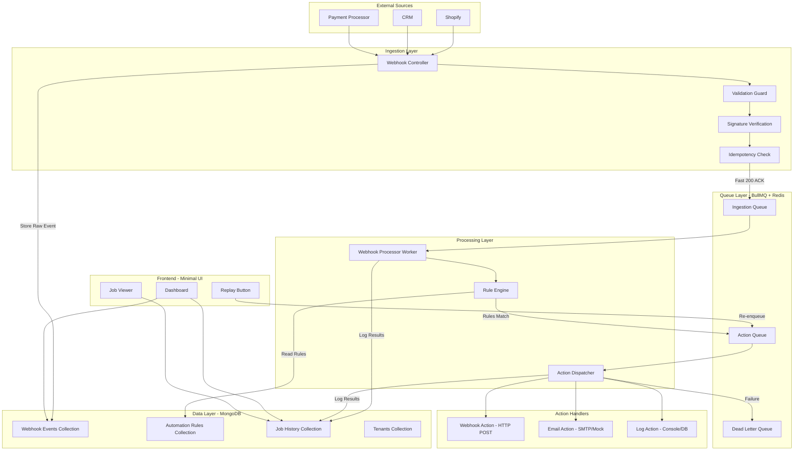
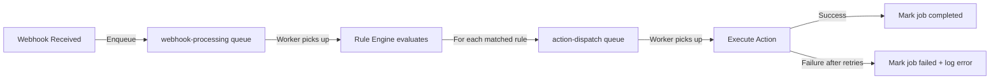
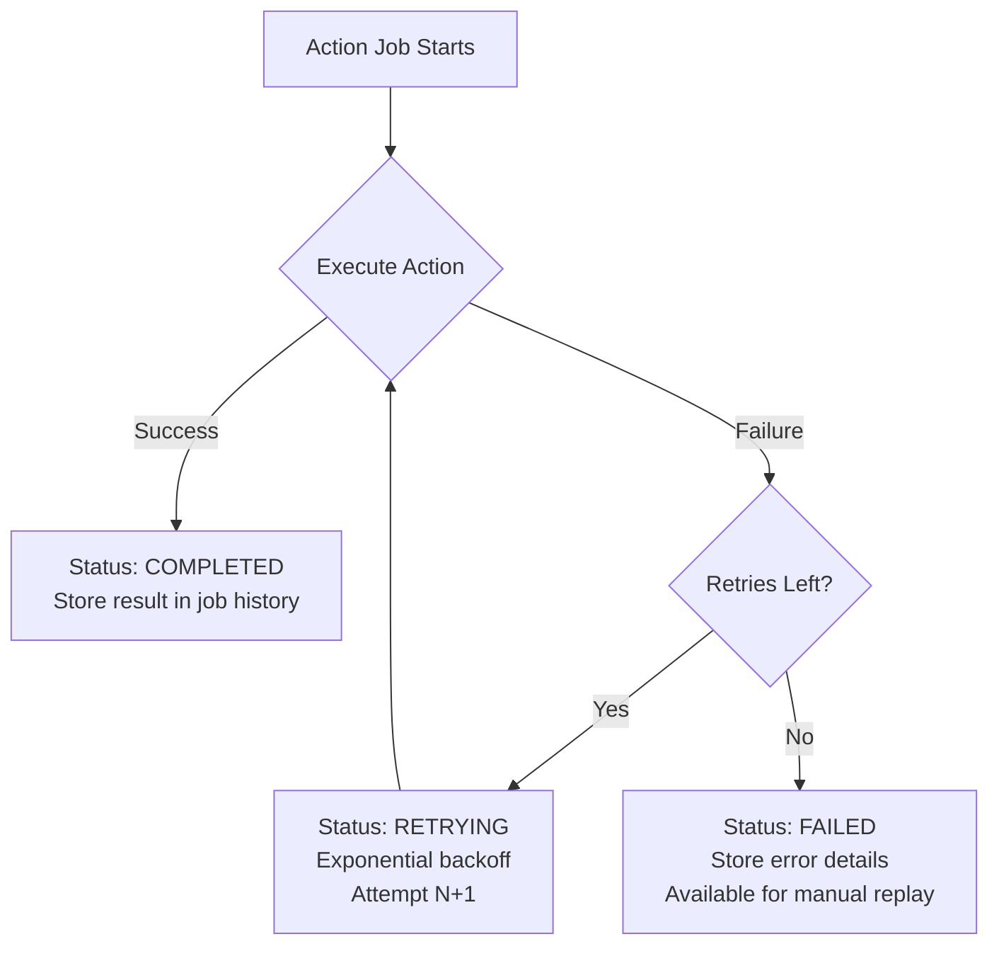

# Debales AI — Async Webhook Automation Engine: Complete Implementation Plan

## 📋 Assignment Overview

**Role:** Full-Time Full Stack Developer  
**Stack:** NestJS · BullMQ · Redis · MongoDB (Mongoose)  
**Goal:** Build a multi-tenant async webhook automation engine that reliably ingests webhooks, evaluates automation rules, dispatches actions, and provides full observability with replay capability.

---

## 🔴 CRITICAL REQUIREMENTS (Non-Negotiable Constraints)

> [!CAUTION]
> These are **fixed constraints** from the brief. Violating any of these is an automatic fail.

| # | Constraint | Notes |
|---|-----------|-------|
| 1 | **Backend must be NestJS** | Production stack — they want to see you use guards, interceptors, pipes, modules naturally |
| 2 | **Queue processing via BullMQ + Redis** | No `setTimeout` or fake async — real BullMQ workers |
| 3 | **Data persistence in MongoDB via Mongoose** | Not Prisma, not TypeORM — Mongoose specifically |
| 4 | **Multi-tenant system** | One deployment, many companies, data never mixes |
| 5 | **Minimal read-only UI** | Enough for reviewer to watch system work without Postman/REST client |

---

## 📐 Architecture Overview



---

## 📦 Requirement #1: Reliable Ingestion

### What the brief says:
> *"An incoming webhook should be acknowledged fast. The same event delivered twice should process exactly once. Spoofed or malformed requests should be rejected before they touch your database."*

### Implementation Plan:

#### 1.1 — Fast Acknowledgement (Respond < 200ms)

| Decision | Details |
|----------|---------|
| **Strategy** | Immediately return `200 OK` after validation + dedup check. Enqueue to BullMQ for async processing. |
| **Endpoint** | `POST /webhooks/:tenantId/:source` |
| **Flow** | Validate → Check Idempotency → Store raw event → Enqueue → Return 200 |

```
Controller receives POST →
  ① SignatureGuard verifies HMAC (per-tenant secret) →
  ② ValidationPipe checks payload structure →
  ③ IdempotencyInterceptor checks Redis for event ID →
  ④ If duplicate → return 200 (acknowledge but skip) →
  ⑤ If new → save raw event to MongoDB, enqueue to BullMQ → return 200
```

> [!TIP]
> **NestJS depth signal:** Use a custom `@Guard()` for signature verification and a custom `@UseInterceptors()` for idempotency — shows natural use of NestJS patterns instead of ad-hoc middleware.

#### 1.2 — Idempotency / Deduplication (Exactly-Once Processing)

| Decision | Details |
|----------|---------|
| **Idempotency Key** | Composite: `${tenantId}:${source}:${eventId}` — where `eventId` comes from the webhook payload (e.g., Shopify sends `X-Shopify-Webhook-Id` header) |
| **Storage** | Redis SET with TTL of 24 hours (`SETNX` — atomic check-and-set) |
| **Why Redis?** | Atomic, fast, already in stack for BullMQ. 24h TTL handles late re-deliveries without unbounded growth |
| **Fallback** | Also store `idempotencyKey` in MongoDB `webhookEvents` collection with unique index as secondary safety net |

```typescript
// IdempotencyInterceptor pseudocode
const key = `idemp:${tenantId}:${source}:${eventId}`;
const isNew = await redis.set(key, '1', 'NX', 'EX', 86400);
if (!isNew) {
  // Already processed — acknowledge but skip
  return { status: 'duplicate', message: 'Event already received' };
}
```

#### 1.3 — Spoofed / Malformed Request Rejection

| Attack Vector | Defense | NestJS Pattern |
|---------------|---------|----------------|
| **Spoofed webhook** | HMAC-SHA256 signature verification using tenant's webhook secret | Custom `SignatureGuard` |
| **Malformed payload** | DTO validation with `class-validator` + `ValidationPipe` | Built-in `ValidationPipe` with `whitelist: true, forbidNonWhitelisted: true` |
| **Missing tenant** | Check `tenantId` param against DB | Guard or middleware |
| **Oversized payload** | Limit body size to 1MB in NestJS config | Express body-parser config |

> [!IMPORTANT]
> **Key point for interview:** All rejection happens BEFORE any database write. The guard chain is: `SignatureGuard → TenantGuard → ValidationPipe → IdempotencyInterceptor`. If any step fails, we return an appropriate HTTP error and never touch MongoDB.

---

## 📦 Requirement #2: Async Processing Pipeline

### What the brief says:
> *"The work of evaluating rules and dispatching actions should happen outside the HTTP request. If the worker is killed mid-job and restarted, the job should recover correctly — not silently disappear, and not run twice."*

### Implementation Plan:

#### 2.1 — Queue Architecture

| Queue | Purpose | Concurrency | Retry Policy |
|-------|---------|-------------|--------------|
| `webhook-processing` | Evaluate rules against incoming events | 5 workers | 3 retries, exponential backoff (2s, 4s, 8s) |
| `action-dispatch` | Execute matched actions (HTTP calls, emails, etc.) | 10 workers | 3 retries, exponential backoff (5s, 15s, 45s) |



#### 2.2 — Job Recovery on Worker Crash

| BullMQ Feature | How We Use It |
|----------------|---------------|
| **`removeOnComplete: false`** | Keep completed jobs for observability (with TTL cleanup) |
| **`removeOnFail: false`** | Keep failed jobs so tenant can see them and replay |
| **`attempts: 3`** | Auto-retry with backoff |
| **`backoff: { type: 'exponential' }`** | Prevent hammering failed services |
| **`stalledInterval`** | BullMQ detects stalled jobs (worker died mid-processing) and auto-retries them |
| **`lockDuration: 30000`** | 30s lock — if worker doesn't heartbeat within this, job is considered stalled |

```typescript
// Queue configuration
@Module({
  imports: [
    BullModule.registerQueue({
      name: 'webhook-processing',
      defaultJobOptions: {
        attempts: 3,
        backoff: { type: 'exponential', delay: 2000 },
        removeOnComplete: { age: 86400, count: 1000 }, // Keep for 24h or last 1000
        removeOnFail: false, // Never auto-remove failures
      },
    }),
  ],
})
```

> [!IMPORTANT]
> **For Loom demo:** To show crash recovery, start processing a job, kill the worker process (Ctrl+C), restart it, and show that the stalled job is automatically picked up and completed. BullMQ handles this natively via the stalled job checker.

#### 2.3 — Job Data Model

Each job carries:
```typescript
interface WebhookJobData {
  webhookEventId: string;     // Reference to stored raw event
  tenantId: string;           // Tenant isolation
  source: string;             // e.g., 'shopify', 'stripe'
  eventType: string;          // e.g., 'order.created'
  payload: Record<string, any>;
  receivedAt: Date;
  idempotencyKey: string;     // For dedup verification
}
```

---

## 📦 Requirement #3: Automation Rule Evaluation

### What the brief says:
> *"A tenant configures rules: 'when event type X arrives from source Y, and the payload matches condition Z, do action A.' Show at least two action types. Show what happens when an action fails."*

### Implementation Plan:

#### 3.1 — Rule Schema (MongoDB)

```typescript
interface AutomationRule {
  _id: ObjectId;
  tenantId: ObjectId;           // Owner tenant
  name: string;                 // Human-readable name
  isActive: boolean;            // Enable/disable toggle
  
  // Trigger conditions
  trigger: {
    source: string;             // e.g., 'shopify'
    eventType: string;          // e.g., 'order.created'
    conditions: Condition[];    // Payload matching conditions
  };
  
  // Actions to execute when rule matches
  actions: Action[];
  
  createdAt: Date;
  updatedAt: Date;
}

interface Condition {
  field: string;        // JSON path in payload, e.g., 'order.total_price'
  operator: string;     // 'equals' | 'greater_than' | 'less_than' | 'contains' | 'exists'
  value: any;           // Comparison value
}

interface Action {
  type: 'webhook' | 'email' | 'log';
  config: WebhookActionConfig | EmailActionConfig | LogActionConfig;
}
```

#### 3.2 — Rule Engine Implementation

The rule engine is a service that:
1. Queries active rules for the tenant + source + eventType combination
2. Evaluates each rule's conditions against the event payload
3. For each matching rule, enqueues action jobs to the `action-dispatch` queue

```typescript
// Supported operators (start with 3 solid ones)
const OPERATORS = {
  equals: (fieldValue, condValue) => fieldValue === condValue,
  greater_than: (fieldValue, condValue) => Number(fieldValue) > Number(condValue),
  less_than: (fieldValue, condValue) => Number(fieldValue) < Number(condValue),
  contains: (fieldValue, condValue) => String(fieldValue).includes(String(condValue)),
  exists: (fieldValue) => fieldValue !== undefined && fieldValue !== null,
};
```

> [!NOTE]
> The brief explicitly says: *"A working engine with three operators beats a broken one with ten."* — So we implement 5 solid operators (`equals`, `greater_than`, `less_than`, `contains`, `exists`) with full test coverage rather than 10 half-baked ones.

#### 3.3 — Action Types (Minimum 2 Required, We'll Do 3)

| Action Type | What It Does | Config | Failure Mode |
|-------------|-------------|--------|--------------|
| **`webhook`** | Sends HTTP POST to a configured URL with event data | `{ url: string, headers?: Record<string, string> }` | HTTP timeout, 4xx/5xx response |
| **`email`** | Sends notification email (mock SMTP via Ethereal or console log) | `{ to: string, subject: string, templateId?: string }` | SMTP connection failure |
| **`log`** | Writes structured log entry to MongoDB | `{ level: 'info' \| 'warn', message: string }` | Always succeeds (fallback action) |

#### 3.4 — Action Failure Handling



**On failure, we store:**
- Error message and stack trace
- HTTP status code (for webhook actions)
- Attempt number
- Timestamp of each attempt
- The original job data (so it can be replayed exactly)

---

## 📦 Requirement #4: Visibility and Recovery

### What the brief says:
> *"A tenant should be able to see every job that ran, what status it is in, why it failed if it failed, and trigger a replay of a failed job. This is not a bonus."*

### Implementation Plan:

#### 4.1 — Job History Data Model

```typescript
interface JobHistory {
  _id: ObjectId;
  tenantId: ObjectId;
  webhookEventId: ObjectId;     // Link to original event
  ruleId: ObjectId;             // Which rule triggered this
  ruleName: string;             // Denormalized for display
  
  // Status tracking
  status: 'pending' | 'processing' | 'completed' | 'failed' | 'retrying';
  
  // Action details
  actionType: 'webhook' | 'email' | 'log';
  actionConfig: Record<string, any>;
  
  // Execution details
  attempts: {
    attemptNumber: number;
    startedAt: Date;
    completedAt: Date;
    status: 'success' | 'failure';
    result?: any;               // Success response
    error?: {                   // Failure details
      message: string;
      code?: string;
      httpStatus?: number;
      stack?: string;
    };
  }[];
  
  // Timing
  createdAt: Date;
  updatedAt: Date;
  completedAt?: Date;
  
  // Replay tracking
  isReplay: boolean;
  originalJobId?: ObjectId;     // If this is a replay, link to original
}
```

#### 4.2 — API Endpoints for Visibility

| Endpoint | Method | Purpose |
|----------|--------|---------|
| `/api/jobs` | GET | List all jobs for current tenant (paginated, filterable by status) |
| `/api/jobs/:jobId` | GET | Get full job details including all attempts |
| `/api/jobs/:jobId/replay` | POST | Re-enqueue a failed job for processing |
| `/api/events` | GET | List all received webhook events for current tenant |
| `/api/events/:eventId` | GET | Get event details and associated jobs |
| `/api/rules` | GET | List all automation rules for current tenant |
| `/api/rules` | POST | Create a new automation rule |
| `/api/rules/:ruleId` | PUT | Update rule |
| `/api/rules/:ruleId` | DELETE | Delete rule |

#### 4.3 — Replay Mechanism

```typescript
// ReplayService
async replayJob(jobId: string, tenantId: string): Promise<JobHistory> {
  const originalJob = await this.jobHistoryModel.findOne({ 
    _id: jobId, 
    tenantId,  // TENANT ISOLATION: Never let tenant replay another tenant's job
    status: 'failed' 
  });
  
  if (!originalJob) throw new NotFoundException();
  
  // Create new job history entry linked to original
  const replayJob = await this.jobHistoryModel.create({
    ...originalJob.toObject(),
    _id: new Types.ObjectId(),
    status: 'pending',
    attempts: [],
    isReplay: true,
    originalJobId: originalJob._id,
    createdAt: new Date(),
  });
  
  // Re-enqueue to action-dispatch queue
  await this.actionQueue.add('dispatch', {
    jobHistoryId: replayJob._id.toString(),
    tenantId,
    actionType: originalJob.actionType,
    actionConfig: originalJob.actionConfig,
    eventPayload: originalJob.eventPayload,
  });
  
  return replayJob;
}
```

---

## 📦 Requirement #5: Tenant Isolation

### What the brief says:
> *"One tenant's data, rules, and job history must be completely invisible to another. This should be enforced on the server — not just filtered in the UI."*

### Implementation Plan:

#### 5.1 — Authentication (Simple Stub — Brief Says This Is OK)

```typescript
// Simple auth middleware — "login as user X" stub
// In production this would be JWT/OAuth. For this assignment, we use
// a simple header-based tenant selection.

@Injectable()
export class TenantMiddleware implements NestMiddleware {
  use(req: Request, res: Response, next: NextFunction) {
    const tenantId = req.headers['x-tenant-id'] as string;
    if (!tenantId) {
      throw new UnauthorizedException('Missing X-Tenant-Id header');
    }
    req['tenantId'] = tenantId;
    next();
  }
}
```

#### 5.2 — Server-Side Enforcement Strategy

| Layer | Mechanism |
|-------|-----------|
| **Middleware** | Extract `tenantId` from request (header or token) and attach to request context |
| **Guards** | `TenantGuard` validates tenantId exists in DB |
| **Service Layer** | ALL queries include `{ tenantId }` filter — never query without it |
| **Mongoose Middleware** | Pre-save hook ensures tenantId is always set |
| **MongoDB Indexes** | Compound indexes with `tenantId` as first field for query efficiency |
| **Queue Jobs** | Every job payload includes `tenantId`; worker verifies before processing |

```typescript
// EVERY query in EVERY service looks like this:
async findJobs(tenantId: string, filters: JobFilters) {
  return this.jobHistoryModel.find({ 
    tenantId,  // ALWAYS present — never optional
    ...filters 
  });
}
```

> [!WARNING]
> **Common pitfall:** Don't rely on UI-side filtering for isolation. The brief specifically says "enforced on the server." Every database query must include `tenantId` as a mandatory filter. Consider creating a base service class that enforces this pattern.

#### 5.3 — Seed Data for Demo

Create 2 tenants for demonstration:
- **Tenant A:** "Acme Corp" — has Shopify rules
- **Tenant B:** "Beta Store" — has Stripe rules

Show in the Loom that switching tenants shows completely different data.

---

## 📦 Requirement #6: Minimal Read-Only UI

### What the brief says:
> *"A minimal read-only UI is required — enough for a reviewer to watch the system work without a REST client. Framework is your choice; do not over-invest here."*

### Implementation Plan:

#### 6.1 — Technology Choice

| Option | Decision |
|--------|----------|
| **Framework** | **React with Vite** — fast to set up, familiar, minimal config |
| **Styling** | Simple CSS or a lightweight library (e.g., vanilla CSS) |
| **State** | React Query (TanStack Query) for server state with auto-polling |

#### 6.2 — UI Pages/Views

| Page | What It Shows | Key Features |
|------|--------------|--------------|
| **Tenant Selector** | Dropdown to switch between tenants | Simple "login as" stub |
| **Dashboard** | Summary stats: total events, jobs by status, recent activity | Auto-refreshing counters |
| **Webhook Events** | Table of received events: timestamp, source, type, status | Sortable, filterable |
| **Job History** | Table of all jobs: rule name, status, action type, attempts, error | Color-coded status badges |
| **Job Detail** | Full details of a single job including all attempt logs | **Replay button** for failed jobs |
| **Rules** | List of automation rules per tenant | Read-only display |

#### 6.3 — Auto-Polling for Live Demo

```typescript
// Use React Query with refetchInterval for live updates during Loom demo
const { data: jobs } = useQuery({
  queryKey: ['jobs', tenantId],
  queryFn: () => fetchJobs(tenantId),
  refetchInterval: 2000,  // Poll every 2 seconds for demo
});
```

---

## 📦 Requirement #7: Scaling Question (README Section)

### What the brief says:
> *"500,000 orders/day × 3 webhooks = ~1,500,000 events/day from one tenant. Spikes of 10x during flash sales. Walk us through how your design handles this. Where does it break first?"*

### Answer Structure (to include in README):

#### 7.1 — Current Design Under Load Analysis

| Component | Events/sec Normal | Events/sec Peak (10x) | Breaking Point |
|-----------|------------------|----------------------|----------------|
| **Webhook ingestion** | ~17/sec | ~170/sec | Single NestJS process handles ~1000 req/sec — OK |
| **Redis dedup check** | ~17/sec | ~170/sec | Redis handles 100k+ ops/sec — OK |
| **MongoDB raw event write** | ~17/sec | ~170/sec | Single write per event — starts to strain at ~5000/sec |
| **BullMQ enqueue** | ~17/sec | ~170/sec | Redis-backed, handles well |
| **Worker processing** | ~17/sec | ~170/sec | **FIRST BOTTLENECK** — depends on rule complexity + action execution time |
| **Action dispatch** | ~17-50/sec (rules match) | ~170-500/sec | **SECOND BOTTLENECK** — downstream HTTP calls have latency |

#### 7.2 — Where It Breaks First & Fixes (In Order)

1. **Worker Throughput** → Horizontal scaling of workers, separate worker processes
2. **MongoDB Write Load** → Batch inserts, write concern tuning, sharding by tenantId
3. **Redis Memory** → Redis Cluster, TTL tuning for dedup keys
4. **Action Dispatch Latency** → Connection pooling, circuit breakers, separate queues per action type
5. **Single Node NestJS** → Load balancer + multiple ingestion instances (stateless by design)

---

## 📂 Project Structure

```
webhook-engine/
├── docker-compose.yml              # MongoDB + Redis + App
├── .env.example                    # All required env vars
├── README.md                       # Setup, design decisions, scaling answer
│
├── backend/                        # NestJS application
│   ├── src/
│   │   ├── main.ts
│   │   ├── app.module.ts
│   │   │
│   │   ├── common/                 # Shared utilities
│   │   │   ├── guards/
│   │   │   │   ├── signature.guard.ts         # HMAC webhook verification
│   │   │   │   └── tenant.guard.ts            # Tenant existence check
│   │   │   ├── interceptors/
│   │   │   │   └── idempotency.interceptor.ts # Dedup check
│   │   │   ├── middleware/
│   │   │   │   └── tenant.middleware.ts        # Extract tenantId
│   │   │   ├── pipes/
│   │   │   │   └── webhook-validation.pipe.ts  # Payload validation
│   │   │   ├── decorators/
│   │   │   │   └── tenant.decorator.ts         # @CurrentTenant()
│   │   │   └── filters/
│   │   │       └── all-exceptions.filter.ts    # Global error handler
│   │   │
│   │   ├── modules/
│   │   │   ├── tenants/             # Tenant management
│   │   │   │   ├── tenants.module.ts
│   │   │   │   ├── tenants.controller.ts
│   │   │   │   ├── tenants.service.ts
│   │   │   │   ├── schemas/
│   │   │   │   │   └── tenant.schema.ts
│   │   │   │   └── dto/
│   │   │   │       └── create-tenant.dto.ts
│   │   │   │
│   │   │   ├── webhooks/            # Webhook ingestion
│   │   │   │   ├── webhooks.module.ts
│   │   │   │   ├── webhooks.controller.ts      # POST /webhooks/:tenantId/:source
│   │   │   │   ├── webhooks.service.ts
│   │   │   │   ├── schemas/
│   │   │   │   │   └── webhook-event.schema.ts
│   │   │   │   └── dto/
│   │   │   │       └── incoming-webhook.dto.ts
│   │   │   │
│   │   │   ├── rules/               # Automation rules
│   │   │   │   ├── rules.module.ts
│   │   │   │   ├── rules.controller.ts
│   │   │   │   ├── rules.service.ts
│   │   │   │   ├── rule-engine.service.ts      # Core evaluation logic
│   │   │   │   ├── schemas/
│   │   │   │   │   └── automation-rule.schema.ts
│   │   │   │   └── dto/
│   │   │   │       └── create-rule.dto.ts
│   │   │   │
│   │   │   ├── jobs/                # Job history & visibility
│   │   │   │   ├── jobs.module.ts
│   │   │   │   ├── jobs.controller.ts
│   │   │   │   ├── jobs.service.ts
│   │   │   │   ├── schemas/
│   │   │   │   │   └── job-history.schema.ts
│   │   │   │   └── dto/
│   │   │   │       └── job-filter.dto.ts
│   │   │   │
│   │   │   └── queue/               # BullMQ workers & processors
│   │   │       ├── queue.module.ts
│   │   │       ├── processors/
│   │   │       │   ├── webhook.processor.ts    # webhook-processing queue consumer
│   │   │       │   └── action.processor.ts     # action-dispatch queue consumer
│   │   │       └── actions/
│   │   │           ├── action.factory.ts       # Factory pattern for action handlers
│   │   │           ├── webhook.action.ts       # HTTP POST action
│   │   │           ├── email.action.ts         # Email notification action
│   │   │           └── log.action.ts           # Structured log action
│   │   │
│   │   └── seed/                    # Seed data for demo
│   │       └── seed.service.ts      # Creates demo tenants + rules
│   │
│   ├── test/                        # E2E tests
│   │   └── webhook-flow.e2e-spec.ts
│   ├── package.json
│   ├── tsconfig.json
│   └── nest-cli.json
│
├── frontend/                        # React + Vite minimal UI
│   ├── src/
│   │   ├── App.tsx
│   │   ├── main.tsx
│   │   ├── api/                     # API client
│   │   │   └── client.ts
│   │   ├── components/
│   │   │   ├── TenantSelector.tsx
│   │   │   ├── Dashboard.tsx
│   │   │   ├── EventsTable.tsx
│   │   │   ├── JobsTable.tsx
│   │   │   ├── JobDetail.tsx
│   │   │   └── RulesList.tsx
│   │   └── index.css
│   ├── package.json
│   └── vite.config.ts
│
└── scripts/
    ├── send-webhook.sh              # curl command to simulate webhook
    ├── send-duplicate.sh            # Send same event twice (dedup demo)
    └── trigger-failure.sh           # Send event that triggers a failing action
```

---

## 📊 Data Model Summary

### MongoDB Collections & Indexes

#### `tenants` Collection
```javascript
{
  _id: ObjectId,
  name: "Acme Corp",
  slug: "acme-corp",
  webhookSecret: "whsec_...",        // For HMAC verification
  isActive: true,
  createdAt: Date,
  updatedAt: Date
}
// Indexes:
// { slug: 1 } — unique
```

#### `webhook_events` Collection
```javascript
{
  _id: ObjectId,
  tenantId: ObjectId,                // ref: tenants
  source: "shopify",                 // Platform source
  eventType: "order.created",        // Event type
  idempotencyKey: "tenant1:shopify:evt_abc123",  // For dedup
  headers: { ... },                  // Raw headers (useful for debugging)
  payload: { ... },                  // Raw event payload
  status: "processed",              // 'received' | 'processing' | 'processed' | 'failed'
  receivedAt: Date,
  processedAt: Date
}
// Indexes:
// { tenantId: 1, receivedAt: -1 }    — Tenant-scoped queries, sorted by time
// { idempotencyKey: 1 }              — Unique, for dedup
// { tenantId: 1, source: 1, eventType: 1 } — Rule matching lookups
```

#### `automation_rules` Collection
```javascript
{
  _id: ObjectId,
  tenantId: ObjectId,
  name: "High-value order alert",
  isActive: true,
  trigger: {
    source: "shopify",
    eventType: "order.created",
    conditions: [
      { field: "order.total_price", operator: "greater_than", value: 500 }
    ]
  },
  actions: [
    { type: "webhook", config: { url: "https://hooks.slack.com/...", headers: {} } },
    { type: "email", config: { to: "sales@acme.com", subject: "High-value order!" } }
  ],
  createdAt: Date,
  updatedAt: Date
}
// Indexes:
// { tenantId: 1, isActive: 1, 'trigger.source': 1, 'trigger.eventType': 1 }
```

#### `job_history` Collection
```javascript
{
  _id: ObjectId,
  tenantId: ObjectId,
  webhookEventId: ObjectId,          // ref: webhook_events
  ruleId: ObjectId,                  // ref: automation_rules
  ruleName: "High-value order alert", // Denormalized
  bullJobId: "webhook-processing:42", // BullMQ job ID for correlation
  
  status: "failed",                  // 'pending' | 'processing' | 'completed' | 'failed' | 'retrying'
  actionType: "webhook",
  actionConfig: { url: "..." },
  
  attempts: [
    {
      attemptNumber: 1,
      startedAt: Date,
      completedAt: Date,
      status: "failure",
      error: { message: "ECONNREFUSED", code: "NETWORK_ERROR" }
    },
    {
      attemptNumber: 2,
      startedAt: Date,
      completedAt: Date, 
      status: "failure",
      error: { message: "Timeout after 10s", code: "TIMEOUT" }
    }
  ],
  
  isReplay: false,
  originalJobId: null,
  
  createdAt: Date,
  updatedAt: Date,
  completedAt: null
}
// Indexes:
// { tenantId: 1, status: 1, createdAt: -1 }    — Dashboard queries
// { tenantId: 1, webhookEventId: 1 }            — Event → jobs lookup
// { tenantId: 1, ruleId: 1 }                    — Rule → jobs lookup
```

---

## 🧪 Verification Plan

### Automated Tests

```bash
# Unit tests
cd backend && npm run test

# E2E tests
cd backend && npm run test:e2e
```

**Key test scenarios:**
1. ✅ Webhook received → 200 OK → job enqueued
2. ✅ Duplicate webhook → 200 OK → job NOT enqueued
3. ✅ Invalid signature → 401 Unauthorized
4. ✅ Malformed payload → 400 Bad Request
5. ✅ Rule matches → action dispatched
6. ✅ Rule doesn't match → no action
7. ✅ Action fails → retried → eventually marked failed
8. ✅ Failed job replayed → new job created and processed
9. ✅ Tenant A cannot see Tenant B's data

### Manual Verification (Loom Demo Script)

| Step | What to Show | How |
|------|-------------|-----|
| 1 | Send webhook, see fast ACK | `curl` command → show 200 response in < 200ms |
| 2 | Job appears in UI | Switch to browser → see new job in table |
| 3 | Job completes | Watch status change from pending → completed |
| 4 | Send duplicate | Same `curl` → show "duplicate" response, no new job |
| 5 | Crash recovery | Start a slow job → kill worker → restart → job completes |
| 6 | Trigger failure | Send event matching rule with unreachable webhook URL |
| 7 | See failure in UI | Show error details in job detail page |
| 8 | Replay failed job | Click replay button → watch new job succeed/fail |
| 9 | Tenant isolation | Switch tenant → show completely different data |
| 10 | Walk through a decision | Pick the dedup strategy or the queue architecture |

### Docker Compose Verification

```bash
# Full stack startup
docker-compose up -d

# Verify all services are running
docker-compose ps

# Run seed data
docker-compose exec backend npm run seed

# Send test webhook
./scripts/send-webhook.sh
```

---

## 📤 Submission Checklist

| Deliverable | Status | Notes |
|-------------|--------|-------|
| Git repository (public link or zip) | ⬜ | Include `.env.example` |
| README: Setup & run instructions | ⬜ | `docker-compose up` should be all that's needed |
| README: Data model description + justification | ⬜ | See Data Model section above |
| README: Queue design description | ⬜ | Job structure, failure handling, recovery |
| README: How to simulate webhook (`curl` command) | ⬜ | Include test scripts |
| README: How to trigger failure and replay | ⬜ | Step-by-step instructions |
| README: Scaling question answer (1-2 pages) | ⬜ | See Requirement #7 |
| Loom recording (5-10 minutes) | ⬜ | Follow the 6-step demo script from brief |
| `.env.example` with all variables | ⬜ | MongoDB URI, Redis URL, ports, secrets |
| `docker-compose.yml` | ⬜ | MongoDB + Redis + Backend + Frontend |

---

## ⏱ Estimated Implementation Timeline

| Phase | Tasks | Estimated Time |
|-------|-------|---------------|
| **Phase 1: Foundation** | Project setup, Docker, MongoDB schemas, tenant module | 3-4 hours |
| **Phase 2: Ingestion** | Webhook controller, guards, interceptors, dedup | 3-4 hours |
| **Phase 3: Queue & Processing** | BullMQ setup, workers, rule engine | 4-5 hours |
| **Phase 4: Actions** | Action handlers (webhook, email, log), failure handling | 3-4 hours |
| **Phase 5: Visibility** | Job history API, replay mechanism | 2-3 hours |
| **Phase 6: Frontend** | React UI with tables, status badges, replay button | 3-4 hours |
| **Phase 7: Testing & Polish** | E2E tests, seed data, scripts, README, scaling answer | 3-4 hours |
| **Phase 8: Loom Recording** | Record 5-10 min demo following the script | 1 hour |
| **Total** | | **~22-28 hours** |

---

## 🔑 Key Design Decisions to Highlight in Loom

> [!TIP]
> The brief asks you to spend 2 minutes on "one decision you're proud of." Here are strong candidates:

1. **Idempotency Strategy** — Redis SETNX + MongoDB unique index dual-layer dedup. Explain why Redis alone isn't enough (what if Redis restarts?) and why MongoDB alone isn't fast enough for the hot path.

2. **Two-Queue Architecture** — Separating `webhook-processing` from `action-dispatch`. This allows independent scaling and prevents slow downstream actions from blocking event evaluation.

3. **Tenant Isolation at Every Layer** — Not just middleware, but guards, service-level query enforcement, and queue job verification. Demonstrate that even if someone bypasses the UI, the API enforces isolation.

---

## Open Questions

> [!IMPORTANT]
> **Before starting implementation, clarify these with yourself or note your decisions:**

1. **Webhook signature format:** Will you use a generic HMAC-SHA256 scheme or simulate specific platform signatures (Shopify's `X-Shopify-Hmac-Sha256`)? 
   - **Recommendation:** Generic HMAC for the assignment, mention platform-specific support in README as an extension point.

2. **Email action:** Real SMTP (Ethereal for testing) or mock console log?
   - **Recommendation:** Use [Ethereal](https://ethereal.email/) — it's a real SMTP server that captures emails for testing. Shows maturity.

3. **Frontend routing:** Single page with tabs or React Router?
   - **Recommendation:** Simple tabs — don't over-invest per the brief.

4. **How many demo tenants?** 
   - **Recommendation:** 2 tenants with distinct rules and data. Enough to prove isolation.
